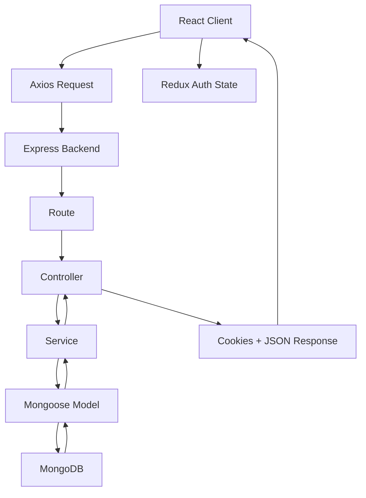

# Backend and Fullstack Learning Projects - README Notes

## Table of Contents

1. [Project Overview](#project-overview)
2. [Workspace Folder Structure](#workspace-folder-structure)
3. [Main Project: fullstack](#main-project-fullstack)
4. [Project Flow](#project-flow)
5. [Authentication](#authentication)
6. [API Notes](#api-notes)
7. [Database Notes](#database-notes)
8. [File Wise Notes](#file-wise-notes)
9. [Function Wise Notes](#function-wise-notes)
10. [Other Learning Projects](#other-learning-projects)
11. [Important Libraries](#important-libraries)
12. [Environment Variables](#environment-variables)
13. [My Notes Comparison](#my-notes-comparison)
14. [Common Bugs and Debugging](#common-bugs-and-debugging)
15. [Interview Notes](#interview-notes)
16. [Viva Notes](#viva-notes)
17. [Quick Revision](#quick-revision)
18. [Cheat Sheet](#cheat-sheet)
19. [Learning Summary](#learning-summary)

---

# Project Overview

This workspace contains multiple backend and fullstack practice projects. The main complete project is `fullstack`, which has:

- A React frontend.
- An Express backend.
- MongoDB database connection using Mongoose.
- User registration.
- User login.
- JWT authentication using access token and refresh token.
- Cookie-based authentication.
- Protected and public routes on the frontend.
- Redux state for storing the logged-in user in the browser.

The other folders are learning steps that build toward the main project:

- `creating_first_server`: first Node HTTP server.
- `express and rest api`: basic Express routes.
- `CRUD`: in-memory CRUD.
- `introduction_to_database`: MongoDB CRUD.
- `authentication`: basic register/login with bcrypt and JWT.
- `access_token_and_refresh_token`: JWT stored in cookies.
- `ART`: access token and refresh token practice.
- `GEH`: global error handler and service/controller separation practice.
- `integeration`: React form connected to Express and MongoDB.
- `todoList`: fullstack todo CRUD app.

## Main Purpose

The main purpose of this workspace is to learn backend development step by step:

1. Create a server.
2. Create REST APIs.
3. Connect MongoDB.
4. Create models.
5. Build authentication.
6. Hash passwords.
7. Generate JWT tokens.
8. Store tokens in cookies.
9. Protect routes.
10. Connect frontend and backend.

## Real-Life Analogy

Imagine a college building:

- Frontend is the student-facing reception desk.
- Backend is the office staff that checks records.
- Database is the filing room.
- JWT token is an ID card.
- Cookie is the wallet where the browser keeps the ID card.
- Middleware is the security guard at the gate.

---

# Workspace Folder Structure

```text
backend/
  access_token_and_refresh_token/
  ART/
  authentication/
  creating_first_server/
  CRUD/
  express and rest api/
  FTP/
  fullstack/
    client/
    server/
  GEH/
  integeration/
    backend/
    frontend/
  introduction_to_database/
  todoList/
    client/
    server/
```

## Folder Explanation

| Folder | Meaning | Why it exists |
|---|---|---|
| `creating_first_server` | Basic Node.js HTTP server | Shows how a server works before Express. |
| `express and rest api` | Basic Express REST API | Shows `GET` and `POST` with dummy data. |
| `CRUD` | In-memory student CRUD | Shows create, read, update, delete without database. |
| `introduction_to_database` | Express + MongoDB CRUD | Shows how Mongoose stores data in MongoDB. |
| `authentication` | User auth practice | Shows register, login, bcrypt, JWT, cookies. |
| `access_token_and_refresh_token` | Cookie JWT practice | Shows JWT methods inside Mongoose model. |
| `ART` | Access token and refresh token practice | Shows separate access/refresh token generation. |
| `GEH` | Global error handler practice | Shows async handler, API response, custom error class. |
| `integeration` | Frontend-backend product form | Shows React form posting data to backend. |
| `todoList` | Fullstack todo CRUD | Shows React + Express + MongoDB CRUD flow. |
| `fullstack` | Main auth app | Combines React, Redux, Express, MongoDB, JWT cookies. |
| `FTP` | Folder exists but no source file was found by the code scan | I could not find enough information in the code. |

---

# Main Project: fullstack

## What It Does

The `fullstack` project allows a user to:

1. Register with name, email, and password.
2. Login with email and password.
3. Receive access and refresh tokens in HTTP-only cookies.
4. Stay logged in while the access token cookie is valid.
5. Open a protected home page.
6. Logout by clearing the access token cookie.

## Main Architecture



## Frontend Stack

| Tool | Simple Explanation | Technical Meaning |
|---|---|---|
| React | Builds UI using components | JavaScript library for user interfaces. |
| Vite | Starts frontend quickly | Development build tool. |
| React Router | Changes pages without reload | Client-side routing library. |
| Redux Toolkit | Stores app-wide user state | Predictable state management. |
| React Hook Form | Handles form values and validation | Form state library. |
| Axios | Sends API calls | HTTP client. |
| Tailwind CSS | Adds styling using classes | Utility-first CSS framework. |

## Backend Stack

| Tool | Simple Explanation | Technical Meaning |
|---|---|---|
| Express | Creates APIs | Node.js web framework. |
| Mongoose | Talks to MongoDB using models | ODM for MongoDB. |
| bcrypt | Hides passwords | Password hashing library. |
| jsonwebtoken | Creates login tokens | JWT signing and verification library. |
| cookie-parser | Reads cookies from request | Express middleware for cookies. |
| cors | Allows frontend to call backend | Cross-Origin Resource Sharing middleware. |
| dotenv | Loads `.env` variables | Environment variable loader. |

---

# Project Flow

## User Opens App

```text
User opens React app
  ↓
main.jsx renders AppRoute
  ↓
Redux Provider wraps the app
  ↓
AppRoute calls GET /user/me
  ↓
If cookie is valid, backend returns user
  ↓
Redux stores user
  ↓
Protected/Public route decides where user can go
```

## Register Flow

```text
User fills Register form
  ↓
react-hook-form validates fields
  ↓
Axios sends POST /api/user/register
  ↓
Express route calls registerController
  ↓
Controller calls registerService
  ↓
Service checks required fields
  ↓
Service checks if email already exists
  ↓
Mongoose creates user
  ↓
User model pre-save hook hashes password
  ↓
Service generates access token and refresh token
  ↓
Controller stores tokens in cookies
  ↓
Frontend receives user and stores it in Redux
```

## Login Flow

```text
User fills Login form
  ↓
Axios sends POST /api/user/login
  ↓
Backend finds user by email
  ↓
comparePassword checks entered password with hashed password
  ↓
If correct, JWT tokens are generated
  ↓
Tokens are stored in cookies
  ↓
Frontend stores user in Redux
  ↓
Public route redirects user to /home
```

## Protected Page Flow

```text
User tries /home
  ↓
Protected component checks Redux auth.user
  ↓
If user exists, show Home
  ↓
If user is null, redirect to /
```

## Backend Request Lifecycle

```text
Request
  ↓
cookieParser reads cookies
  ↓
express.json reads JSON body
  ↓
cors allows localhost:5173
  ↓
/api/user route handles request
  ↓
controller executes
  ↓
service performs business logic
  ↓
model talks to MongoDB
  ↓
response returned
  ↓
authMiddleware handles thrown errors
```

---

# Authentication

## Simple Explanation

Authentication means checking who the user is.

Example: When you enter a college, you show your ID card. The guard trusts the card if it is valid.

In this app:

- Email and password are used to login.
- Password is checked using bcrypt.
- Server gives JWT tokens.
- Browser stores tokens in cookies.
- Protected APIs check the access token.

## Technical Explanation

Authentication is implemented using:

- `bcrypt` for password hashing and comparison.
- `jsonwebtoken` for access token and refresh token.
- HTTP-only cookies for storing tokens.
- `access.middleware.js` for checking protected route `/me`.
- Redux for storing the logged-in user on the frontend.

## Password Hashing

Simple Explanation:
Password hashing means changing the password into a one-way hidden form.

Technical Explanation:
`bcrypt.hashSync(password, 10)` converts the plain password into a secure hash. During login, `bcrypt.compareSync(plainPassword, hashedPassword)` checks if the entered password matches the stored hash.

Important:
The actual code in `fullstack/server/src/models/user.model.js` hashes the password in `pre("save")`.

## JWT

Simple Explanation:
A JWT is like a signed ticket. The server can later check if the ticket is real.

Technical Explanation:
JWT is a signed token created using a secret key. In this project, the token payload stores `user_id`.

## Access Token

Simple Explanation:
Short-time ID card.

Technical Explanation:
Generated in `token.js` using `JWT_ACCESS_TOKEN`. It expires in `15m`.

## Refresh Token

Simple Explanation:
Longer-time token used to continue a session.

Technical Explanation:
Generated in `token.js` using `JWT_REFRESH_TOKEN`. It expires in `1d`.

Important:
The main `fullstack` project creates refresh tokens and stores them, but it does not implement a refresh endpoint to generate a new access token after expiry.

## Cookies

Simple Explanation:
Cookies are small values stored by the browser.

Technical Explanation:
The backend sends `accessToken` and `refreshToken` cookies. They are set as `httpOnly`, so frontend JavaScript cannot read them directly.

## Logout

Current logout route:

```text
GET /api/user/logout
```

It clears only the `accessToken` cookie.

Important:
The code does not clear the `refreshToken` cookie. For a more complete logout, both cookies should be cleared.

---

# API Notes

## fullstack Server APIs

Base URL from frontend:

```text
http://localhost:3000/api
```

User routes are mounted at:

```text
/api/user
```

| Route | Method | Purpose | Controller/Middleware | Request Body | Response | Possible Errors | Used By |
|---|---|---|---|---|---|---|---|
| `/api/user/register` | POST | Create new user | `registerController` | `{ name, email, password }` | Message + user, cookies set | 400 missing fields, 409 existing user | `Register.jsx` |
| `/api/user/login` | POST | Login user | `loginController` | `{ email, password }` | Message + user, cookies set | 400 missing fields, 404 not found, 401 wrong credentials | `Login.jsx` |
| `/api/user/me` | GET | Get current logged-in user | `accessTokenMiddleware` | Cookie `accessToken` | Message + user | 404 unauthorized, 500 server error | `AppRoute.jsx` |
| `/api/user/logout` | GET | Logout user | Inline route handler | Cookie | Message | None handled specifically | `Home.jsx` |

## Example Register Request

```json
{
  "name": "Arun",
  "email": "arun@example.com",
  "password": "123456"
}
```

## Example Login Request

```json
{
  "email": "arun@example.com",
  "password": "123456"
}
```

## Example `/me` Response

```json
{
  "message": "User get all time",
  "user": {
    "_id": "...",
    "name": "Arun",
    "email": "arun@example.com",
    "password": "...hashed password...",
    "refreshToken": "..."
  }
}
```

Important:
The current `/me` route returns the whole user document including password hash and refresh token. For production, use `.select("-password -refreshToken")`.

---

# Database Notes

## fullstack User Collection

Model file:

```text
fullstack/server/src/models/user.model.js
```

Fields:

| Field | Type | Why it exists |
|---|---|---|
| `name` | String | Stores user's display name. |
| `email` | String | Used to identify user during login. It is unique. |
| `password` | String | Stores bcrypt hashed password, not plain password. |
| `refreshToken` | String | Stores latest refresh token. |
| `timestamps` | true | Adds `createdAt` and `updatedAt`. |

## Why Mongoose Schema Exists

Simple Explanation:
A schema is like a form format. It tells what fields a document should have.

Technical Explanation:
Mongoose schema defines the structure, validation, defaults, and hooks for MongoDB documents.

## Why Model Exists

Simple Explanation:
A model is the tool used to create, find, update, and delete database records.

Technical Explanation:
Mongoose model provides database methods like `create`, `findOne`, `findById`, and `findByIdAndUpdate`.

---

# File Wise Notes

## fullstack/client

### `main.jsx`

Purpose:
Starts the React app.

Responsibilities:

- Finds the root HTML element.
- Renders `AppRoute`.
- Wraps the app with Redux `Provider`.

How it connects:

- Imports `store` from `app/store.jsx`.
- Imports `AppRoute` from `routes/AppRoute.jsx`.

Interview Question:
Why wrap the app in `Provider`?

Answer:
So every component can access Redux state using `useSelector` and `useDispatch`.

### `routes/AppRoute.jsx`

Purpose:
Defines frontend routes.

Responsibilities:

- Creates browser router.
- Calls `/user/me` when app loads.
- Stores returned user in Redux.
- Defines public routes `/` and `/register`.
- Defines protected route `/home`.

Important Logic:

- `getMeRefresh()` checks whether the cookie still proves the user is logged in.
- If backend returns user, `dispatch(addUser(res.data.user))` stores it.

Common Bug:
If the access token expires, `/me` fails and Redux stays empty. The refresh token is not used to create a new access token in this project.

### `components/Login.jsx`

Purpose:
Shows login form.

Responsibilities:

- Uses `react-hook-form`.
- Sends login data to `/user/login`.
- Dispatches user into Redux after successful login.

Important Note:
The file uses `addUser(res.data.user)` but the code shown did not import `addUser`. Without importing it from `../features/authSlice`, the component will fail.

### `components/Register.jsx`

Purpose:
Shows register form.

Responsibilities:

- Uses `react-hook-form`.
- Validates name, email, and password.
- Sends register data to `/user/register`.
- Dispatches returned user into Redux.

Important Note:
The file uses unused imports/state like `Link`, `useState`, `details`, `setDetails`, and `reset`. These do not break the main logic but should be cleaned.

Common Bug:
Like `Login.jsx`, this file uses `addUser` but does not import it in the code that was inspected.

### `features/authSlice.jsx`

Purpose:
Stores authentication state.

State:

```text
user: null
isAuthenticated: false
```

Reducers:

- `addUser`: stores user and sets `isAuthenticated` to true.
- `removeUser`: clears user and sets `isAuthenticated` to false.

Simple Explanation:
Redux is a common notebook for the whole frontend. Any component can read it.

### `app/store.jsx`

Purpose:
Creates Redux store.

Responsibilities:

- Registers `auth` reducer from `userSlice`.

### `config/axiosInstance.jsx`

Purpose:
Creates one reusable Axios object.

Important Settings:

- `baseURL: "http://localhost:3000/api"`
- `withCredentials: true`

Why `withCredentials` matters:
Without it, browser cookies will not be sent with cross-origin requests.

### `Layout/Public.jsx`

Purpose:
Stops logged-in users from seeing login/register pages.

Logic:

- If `user` exists, redirect to `/home`.
- Otherwise render child route using `Outlet`.

### `Layout/Protected.jsx`

Purpose:
Stops logged-out users from seeing private pages.

Logic:

- If `user` is missing, redirect to `/`.
- Otherwise render child route using `Outlet`.

### `Layout/AuthLayout.jsx`

Purpose:
Wrapper for auth pages.

Current behavior:
It only renders `Outlet`.

### `Layout/MainLayout.jsx`

Purpose:
Wrapper for main app pages.

Current behavior:
It only renders `Outlet`.

### `pages/Home.jsx`

Purpose:
Shows protected home page and logout button.

Responsibilities:

- Calls `/user/logout`.
- Dispatches `removeUser`.

Important Note:
The file uses `removeUser()` but the code shown did not import `removeUser`. It should import it from `../features/authSlice`.

### `vite.config.js`

Purpose:
Configures Vite.

Plugins:

- React plugin.
- Tailwind plugin.

### `index.css`

Purpose:
Loads Tailwind CSS.

---

## fullstack/server

### `server.js`

Purpose:
Starts backend server.

Responsibilities:

- Loads `.env`.
- Imports Express app.
- Connects MongoDB.
- Starts listening on `process.env.PORT`.

### `src/app.js`

Purpose:
Creates and configures Express app.

Middleware order:

1. `cookieParser()`
2. `express.json()`
3. `cors(...)`
4. `/api/user` routes
5. global error middleware

Important:
Error middleware must be after routes because it catches errors from routes/controllers.

### `src/config/db.js`

Purpose:
Connects to MongoDB.

Uses:

- `mongoose.connect(process.env.MONGO_URL)`

If `MONGO_URL` is missing:
The app will not connect to MongoDB.

### `src/routes/user.route.js`

Purpose:
Defines user API routes.

Routes:

- `POST /register`
- `POST /login`
- `GET /me`
- `GET /logout`

Connections:

- Register/login go to controller.
- `/me` uses `accessTokenMiddleware`.

### `src/controllers/user.controller.js`

Purpose:
Handles HTTP request and response.

Responsibilities:

- Calls service layer.
- Sets cookies.
- Sends JSON response.

Why controller exists:
The controller should focus on HTTP details, not database logic.

### `src/services/user.service.js`

Purpose:
Contains business logic for register and login.

Responsibilities:

- Validate required fields.
- Check existing user.
- Create user.
- Compare password.
- Generate tokens.
- Store refresh token.

Important:
This file now uses `findByIdAndUpdate` for refresh token updates so that saving refresh token does not trigger password hashing again.

### `src/models/user.model.js`

Purpose:
Defines user schema and password helper methods.

Important logic:

- `pre("save")` hashes password.
- `comparePassword(password)` compares plain password with stored hash.

Correct bcrypt order:

```text
bcrypt.compareSync(plainPassword, hashedPassword)
```

### `src/middlewares/access.middleware.js`

Purpose:
Protects routes using access token.

Steps:

1. Read `accessToken` from cookies.
2. Verify JWT using `JWT_ACCESS_TOKEN`.
3. Find user by `decode.user_id`.
4. Attach user to `req.user`.
5. Call `next()`.

### `src/middlewares/auth.middleware.js`

Purpose:
Global error handler.

Simple Explanation:
If a controller throws an error, this middleware sends the error response.

Technical Explanation:
Express error middleware has four parameters: `err, req, res, next`.

### `src/utils/token.js`

Purpose:
Creates JWT tokens.

Functions:

- `generateAccessToken(user_id)`
- `generateRefreshToken(user_id)`

### `src/utils/asyncHandler.js`

Purpose:
Avoids writing `try/catch` in every controller.

How it works:

- Takes an async controller.
- Runs it inside `Promise.resolve`.
- Sends errors to `next(error)`.

### `src/utils/ApiError.js`

Purpose:
Custom error class.

Why needed:
It allows services to throw errors with status code and message.

---

# Function Wise Notes

## `registerService(data)`

File:
`fullstack/server/src/services/user.service.js`

Purpose:
Creates a new user and tokens.

Parameters:

- `data`: object containing `name`, `email`, and `password`.

Returns:

- `accessToken`
- `refreshToken`
- `newUser`

Step-by-step:

1. Extract name, email, password.
2. If any field is missing, throw `ApiError(400)`.
3. Find user by email.
4. If user exists, throw `ApiError(409)`.
5. Create new user.
6. Password is hashed by model pre-save hook.
7. Generate access token.
8. Generate refresh token.
9. Save refresh token using update query.
10. Return tokens and user.

## `loginService(data)`

Purpose:
Logs in existing user.

Parameters:

- `data`: object containing `email` and `password`.

Returns:

- `accessToken`
- `refreshToken`
- `isExisted`

Step-by-step:

1. Extract email and password.
2. Check required fields.
3. Find user by email.
4. If not found, throw 404.
5. Compare entered password with stored hash.
6. If wrong, throw 401.
7. Generate tokens.
8. Update refresh token in database.
9. Return tokens and user.

## `comparePassword(password)`

Purpose:
Checks login password.

Parameters:

- `password`: plain password entered by user.

Returns:

- `true` if password matches.
- `false` if password does not match.

Important:

```text
Entered password -> bcrypt compare -> stored hash
```

## `generateAccessToken(user_id)`

Purpose:
Creates short-lived JWT.

Returns:

- JWT string expiring in 15 minutes.

## `generateRefreshToken(user_id)`

Purpose:
Creates longer-lived JWT.

Returns:

- JWT string expiring in 1 day.

## `accessTokenMiddleware(req, res, next)`

Purpose:
Checks if request is authenticated.

Step-by-step:

1. Read cookie.
2. If missing, return unauthorized.
3. Verify token.
4. Find user.
5. Add user to request.
6. Continue to route.

## `asyncHandler(requestHandler)`

Purpose:
Centralizes async error handling.

Simple Example:
Instead of writing `try/catch` in every controller, wrap the controller with `asyncHandler`.

---

# Other Learning Projects

## `creating_first_server`

Main file:
`creating_first_server/server.js`

Purpose:
Shows the lowest-level Node server using `http.createServer`.

Flow:

```text
Request comes
  ↓
Node HTTP server receives it
  ↓
Response sends "hello this is my first server"
```

Interview Point:
Express is built on top of Node HTTP ideas. This folder shows what happens before using Express.

## `express and rest api`

Main file:
`express and rest api/server.js`

Purpose:
Shows basic Express REST API.

APIs:

| Route | Method | Purpose |
|---|---|---|
| `/` | GET | Returns dummy student data. |
| `/student` | POST | Reads request body and returns `"ok"`. |

Important Concept:
`express.json()` is needed to read JSON body from requests.

## `CRUD`

Files:

- `CRUD/server.js`
- `CRUD/src/app.js`

Purpose:
Shows CRUD using an array.

APIs:

| Route | Method | Purpose |
|---|---|---|
| `/students` | POST | Adds student to array. |
| `/students/get` | GET | Returns all students. |
| `/students/update/:index` | PATCH | Updates student phone. |
| `/students/delete/:index` | DELETE | Deletes student by index. |

Important Note:
This data is stored only in memory. If server restarts, data is lost.

Bug Note:
The update route uses `students[0][index].phone`, which looks incorrect for a normal array of student objects. Usually it should be `students[index].phone`.

## `introduction_to_database`

Purpose:
Introduces MongoDB with Mongoose.

Files:

- `src/config/db.js`
- `src/models/user.schema.js`
- `src/app.js`
- `server.js`

APIs:

| Route | Method | Purpose |
|---|---|---|
| `/user` | POST | Creates user. |
| `/user-get` | GET | Gets all users. |
| `/user/:id` | PUT | Updates user by id. |
| `/user-delete/:id` | DELETE | Deletes user by id. |

Important Note:
In the create route, the code creates the user before checking required fields. Better order is validate first, then create.

Database note:
`connectDB` currently uses `"khud se use kro"` as the MongoDB URL placeholder. It needs a real MongoDB connection string.

## `authentication`

Purpose:
Shows user register and login with bcrypt and JWT.

Files:

- `server.js`
- `src/app.js`
- `src/config/db.js`
- `src/routes/user.routes.js`
- `src/controllers/user.controller.js`
- `src/models/user.models.js`

APIs:

| Route | Method | Purpose |
|---|---|---|
| `/api/user/register` | POST | Register user. |
| `/api/user/login` | POST | Login user. |
| `/api/user/get` | GET | Get users without password. |

Important Logic:

- Register hashes password using `bcrypt.hash`.
- Register creates JWT using `newUser._id`.
- Login compares password using `bcrypt.compare`.
- Cookie stores token.

Bug Note:
In login, token payload uses `isExisted.password` as id:

```text
jwt.sign({ id: isExisted.password }, ...)
```

It should normally use `isExisted._id`.

## `access_token_and_refresh_token`

Purpose:
Shows auth logic moved into model methods.

Important files:

- `src/models/user.model.js`
- `src/controllers/user.controller.js`
- `src/middlewares/auth.middleware.js`

Important Concepts:

- `generateJWT()` is a model method.
- `comparePassword()` is a model method.
- Auth middleware reads cookie token.

APIs:

| Route | Method | Purpose |
|---|---|---|
| `/api/access_user/register` | POST | Register user and set register token cookie. |
| `/api/access_user/login` | POST | Login user and set login token cookie. |
| `/api/access_user/` | GET | Protected test home route. |

## `ART`

Purpose:
Practices access token and refresh token.

Important Concepts:

- Separate `generateAccessToken`.
- Separate `generateRefreshToken`.
- User schema stores `refreshToken`.
- Password is hashed in model pre-save hook.

APIs:

| Route | Method | Purpose |
|---|---|---|
| `/api/user/register` | POST | Register user and generate tokens. |
| `/api/user/login` | POST | Login user and generate tokens. |

Unfinished/Missing:

- `regenerateAccessToken` exists but is not exported or connected to any route.
- It references `jwt` and `res` but they are not available in that function scope as written.
- Refresh token is assigned to user but not saved in the inspected controller code.
- `auth.middleware.js` defines middleware but does not export it in the inspected content.

## `GEH`

Purpose:
Practices cleaner backend architecture:

- Controller.
- Service.
- Model.
- Async handler.
- Global error handler.
- API response class.
- Custom error class.

API:

| Route | Method | Purpose |
|---|---|---|
| `/api/user/register` | POST | Register user. |

Important Files:

- `utils/asyncHandler.js`: catches controller errors.
- `middlewares/auth.middleware.js`: global error handler.
- `utils/errorHandler.js`: custom `ApiError`.
- `utils/apiResponse.js`: standard response wrapper.

Bug Notes:

- `user.service.js` uses `res.status(...)`, but `res` is not defined in service layer.
- The inspected `user.service.js` did not export `registerService`, but controller requires it.

## `integeration`

Purpose:
Shows frontend-backend integration using product form.

Frontend:

- React controlled form.
- `useState` stores product fields.
- Axios sends POST request.

Backend:

- Express server.
- CORS allows frontend from `localhost:5173`.
- Product schema has nested price object.

API:

| Route | Method | Purpose |
|---|---|---|
| `/product` | POST | Create product. |

Database:

Product fields:

- `productName`
- `description`
- `price.amount`
- `price.currency`
- `category`

Important Note:
Backend uses `process.env.MONG_URL`, not `MONGO_URL`.

## `todoList`

Purpose:
Complete fullstack CRUD todo app.

Frontend:

- User enters task name and description.
- Axios creates task.
- App fetches all tasks.
- List component displays tasks.
- Delete button removes task from database and UI state.

Backend:

- Express app with CORS.
- Router separates path from controller logic.
- Controller handles CRUD.
- Mongoose model stores tasks.

APIs:

| Route | Method | Purpose |
|---|---|---|
| `/api/list/create` | POST | Create task. |
| `/api/list/` | GET | Get all tasks. |
| `/api/list/update/:id` | PUT | Update task. |
| `/api/list/delete/:id` | DELETE | Delete task. |

Important Note:
The frontend has an `update` button, but no update handler is connected in the inspected code.

---

# Important Libraries

| Library | Used In | Why Used | Alternative |
|---|---|---|---|
| `express` | Backend projects | Create APIs and middleware chain | Fastify, Koa |
| `mongoose` | MongoDB projects | Define schemas and interact with MongoDB | Native MongoDB driver |
| `bcrypt` | Auth projects | Hash and compare passwords | argon2 |
| `jsonwebtoken` | Auth projects | Create and verify JWT tokens | jose |
| `cookie-parser` | Auth projects | Read cookies from request | Manual cookie parsing |
| `cors` | Fullstack/integration projects | Allow frontend and backend on different ports | Same-origin deployment |
| `dotenv` | Backend projects | Load `.env` config | OS environment variables |
| `react` | Frontend projects | Build UI components | Vue, Angular |
| `axios` | Frontend projects | Send HTTP requests | fetch |
| `react-router` | fullstack client | Client-side routing | TanStack Router |
| `@reduxjs/toolkit` | fullstack client | Store auth state | Context API, Zustand |
| `react-hook-form` | fullstack client | Form handling and validation | Formik, manual state |
| `tailwindcss` | Frontend projects | Styling with utility classes | CSS modules, plain CSS |

---

# Environment Variables

Do not hardcode secrets in source code. Use `.env`.

| Variable | Used In | Purpose | What breaks if missing |
|---|---|---|---|
| `PORT` | Servers | Decides backend port | Server may listen on undefined or fallback port. |
| `MONGO_URL` | Most MongoDB projects | MongoDB connection string | Database will not connect. |
| `MONG_URL` | `integeration/backend` | MongoDB connection string | Product backend will not connect if wrong name is used. |
| `JWT_TOKEN` | `authentication`, `access_token_and_refresh_token` | Secret for single JWT token | Token signing/verifying fails. |
| `JWT_ACCESS_TOKEN` | `fullstack`, `ART` | Secret for access token | Login token generation or `/me` verification fails. |
| `JWT_REFRESH_TOKEN` | `fullstack`, `ART` | Secret for refresh token | Refresh token generation/verification fails. |

Security Note:
Never write real JWT secrets or MongoDB passwords into README files.

---

# My Notes Comparison

The attached instruction asked for a complete study README. I could not find separate handwritten/class notes in the workspace other than code comments inside source files. I used those comments naturally in the explanations.

## Covered in Notes/Comments

- Express server creation.
- REST API basics.
- Middleware meaning.
- Mongoose schema/model idea.
- Password hashing in schema middleware.
- Controller separation.
- Error handler placement after API routes.
- Access token and refresh token idea.

## Missing from Notes but Present in Code

- Redux auth state in `fullstack/client`.
- Public and protected route components.
- Axios instance with `withCredentials`.
- React Hook Form validation.
- Tailwind styling.
- Todo fullstack CRUD flow.
- Product integration app.
- API response wrapper in `GEH`.

## Extra Implementation Found in Project

- Multiple earlier practice projects showing learning progression.
- Attempted refresh-token regeneration in `ART`.
- Global async error handling in `GEH`.
- Cookie-based `/me` session check in `fullstack`.

## Notes Feature Not Found in Code

I could not find implementation for:

- Socket.IO.
- Chat.
- AI integration.
- Rate limiting.
- Debouncing.
- Context API.
- Custom React hooks.
- Room creation/joining.
- Code editor.

These should not be claimed as project features.

---

# Common Bugs and Debugging

## 1. `bcrypt.compareSync` Always Returns False

Correct order:

```text
bcrypt.compareSync(plainPassword, hashedPassword)
```

Wrong order:

```text
bcrypt.compareSync(hashedPassword, plainPassword)
```

Another common cause:
If password is hashed again after registration, login will fail.

In this project:
Calling `.save()` after changing only `refreshToken` can trigger `pre("save")` and hash password again. The service now uses `findByIdAndUpdate` for refresh token updates.

## 2. `addUser is not defined`

Cause:
`Login.jsx` and `Register.jsx` use `addUser` but did not import it in the inspected code.

Fix:

```text
import { addUser } from "../features/authSlice";
```

## 3. `removeUser is not defined`

Cause:
`Home.jsx` uses `removeUser` but did not import it in the inspected code.

Fix:

```text
import { removeUser } from "../features/authSlice";
```

## 4. Cookies Not Sent to Backend

Causes:

- Axios missing `withCredentials: true`.
- CORS missing `credentials: true`.
- Cookie domain/same-site issue.

Current fullstack code has:

- Axios `withCredentials: true`.
- Backend CORS `credentials: true`.

## 5. `/me` Returns Unauthorized After Some Time

Cause:
Access token expires after 15 minutes.

Current missing part:
The app has refresh token generation but no refresh endpoint in `fullstack`.

## 6. Error Middleware Not Running

Cause:
Error middleware placed before routes.

Correct:
Place global error middleware after routes.

## 7. Service Uses `res`

Cause:
Services should not use Express response object.

Found in:
`GEH/src/services/user.service.js`

Correct idea:
Service should return data or throw error. Controller should send response.

## 8. Returning Password Hash in API Response

Cause:
Returning full Mongoose user document.

Better:
Use `.select("-password -refreshToken")` or manually remove sensitive fields.

---

# Interview Notes

## Authentication Questions

### Why hash passwords?

Expected Answer:
If the database is leaked, plain passwords should not be visible. Hashing converts passwords into a one-way form.

### Why use bcrypt?

Expected Answer:
bcrypt is made for password hashing. It is slow by design, which makes brute-force attacks harder.

### Why JWT?

Expected Answer:
JWT allows the server to issue a signed token. Later, the server can verify the token without storing session data for every request.

### Why access token and refresh token?

Expected Answer:
Access token is short-lived for safety. Refresh token is longer-lived and can be used to create a new access token.

### Why store token in HTTP-only cookie?

Expected Answer:
HTTP-only cookies cannot be read by frontend JavaScript, so they are safer against script-based token theft.

## Backend Architecture Questions

### Why controller and service are separate?

Expected Answer:
Controller handles request/response. Service handles business logic. This keeps code easier to test and maintain.

### Why use middleware?

Expected Answer:
Middleware runs before or after route handlers. It is useful for parsing JSON, reading cookies, checking authentication, and handling errors.

### Why use `asyncHandler`?

Expected Answer:
It catches async errors and passes them to global error middleware, so we do not need repeated `try/catch` in every controller.

## Frontend Questions

### Why Redux?

Expected Answer:
Redux stores login user state globally so route guards and pages can access it.

### Why protected routes?

Expected Answer:
Protected routes stop unauthenticated users from opening private pages.

### Why Axios instance?

Expected Answer:
It avoids repeating base URL and cookie settings in every API call.

## Database Questions

### Why Mongoose?

Expected Answer:
Mongoose gives schemas and helpful methods for MongoDB, making database code easier to organize.

### Why unique email?

Expected Answer:
Each user should have one account per email. It also helps login find one correct user.

---

# Viva Notes

## Explain This Project in Simple Words

This project is a login/register web application. The user enters details on a React page. React sends the data to an Express backend. The backend stores user data in MongoDB. Passwords are not stored directly; they are hashed using bcrypt. After login, the backend sends tokens in cookies. The frontend uses Redux to remember that the user is logged in and allows access to the home page.

## Explain Backend Flow

The backend starts from `server.js`. It connects to MongoDB and starts Express. Express app adds middleware for JSON, cookies, and CORS. User routes are mounted at `/api/user`. Routes call controllers. Controllers call services. Services use models to read and write MongoDB. Errors are sent to the global error handler.

## Explain Frontend Flow

The frontend starts in `main.jsx`. It wraps the app in Redux Provider. `AppRoute.jsx` creates the routes. Public routes show login and register. Protected route shows home only if Redux has a user. Forms use React Hook Form and Axios to call backend APIs.

## Explain Database Flow

The database stores user documents. Each user has name, email, password hash, refresh token, and timestamps. Mongoose model is used to create and find users.

---

# Quick Revision

## Authentication in 2 Minutes

User registers with name, email, password. Backend checks fields and duplicate email. Password is hashed by bcrypt before saving. Backend creates access and refresh tokens. Tokens are stored in HTTP-only cookies. Login checks email and compares password with stored hash. `/me` uses access token cookie to return the user.

## Frontend in 2 Minutes

React app starts in `main.jsx`. Redux Provider gives store access. `AppRoute` defines routes and checks `/user/me` on load. Login/Register forms send data through Axios. Protected route checks Redux user. Home page logs out by calling backend and clearing Redux user.

## Backend in 2 Minutes

`server.js` loads env, connects DB, and starts server. `app.js` sets middleware and routes. Routes call controllers. Controllers set cookies and responses. Services do validation, database work, password check, and token creation. Models define database structure and password methods.

## Database in 2 Minutes

MongoDB stores documents. Mongoose schema defines fields. User model stores name, email, hashed password, refresh token, createdAt, and updatedAt. Todo model stores task name and description. Product model stores product details and nested price.

---

# Cheat Sheet

## Main fullstack Commands

```text
cd fullstack/server
npm start
```

```text
cd fullstack/client
npm run dev
```

## Main API Base

```text
http://localhost:3000/api/user
```

## Main Routes

```text
POST /register
POST /login
GET  /me
GET  /logout
```

## Important Files

```text
fullstack/client/src/routes/AppRoute.jsx
fullstack/client/src/features/authSlice.jsx
fullstack/client/src/config/axiosInstance.jsx
fullstack/server/src/services/user.service.js
fullstack/server/src/models/user.model.js
fullstack/server/src/middlewares/access.middleware.js
fullstack/server/src/utils/token.js
```

## Token Secrets

```text
JWT_ACCESS_TOKEN
JWT_REFRESH_TOKEN
```

## Database URL

```text
MONGO_URL
```

## Correct bcrypt Compare

```text
bcrypt.compareSync(plainPassword, hashedPassword)
```

## Express Middleware Order

```text
cookieParser
express.json
cors
routes
error handler
```

---

# Learning Summary

## Backend Concepts Learned

- Node server basics.
- Express app and routes.
- REST API methods.
- Middleware.
- Controllers.
- Services.
- Global error handling.
- API response structure.

## Frontend Concepts Learned

- React components.
- React forms.
- React Router.
- Protected routes.
- Redux state.
- Axios API calls.
- Tailwind styling.

## Database Concepts Learned

- MongoDB documents.
- Mongoose schemas.
- Mongoose models.
- CRUD operations.
- Nested schema fields.
- Timestamps.

## Authentication Concepts Learned

- Password hashing.
- Password comparison.
- JWT token generation.
- Access token.
- Refresh token.
- HTTP-only cookies.
- Auth middleware.
- Logout flow.

## Deployment/Production Concepts To Improve Later

- Hide sensitive fields in API responses.
- Clear both access and refresh cookies on logout.
- Implement refresh access token route.
- Add server-side validation library like Zod or Joi.
- Add centralized frontend error display.
- Add tests.
- Add proper `.env.example`.
- Add rate limiting for login.
- Use secure cookie options in production.

---

# Final Mental Model

This workspace shows a learning journey.

It starts from:

```text
basic Node server
```

Then moves to:

```text
Express APIs
```

Then:

```text
CRUD
```

Then:

```text
MongoDB
```

Then:

```text
authentication with bcrypt and JWT
```

Then:

```text
fullstack React + Express + MongoDB authentication
```

The main idea is:

```text
Frontend collects data
  ↓
Backend validates and processes data
  ↓
Database stores data
  ↓
JWT proves login
  ↓
Cookies carry JWT
  ↓
Redux remembers logged-in user on frontend
```

